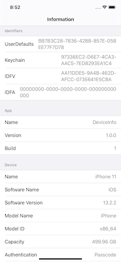
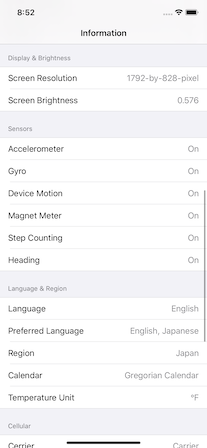
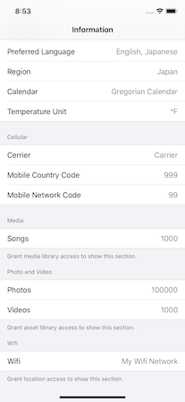

# AppPattern: DeviceInfo

This is an example implementation of an app feature that displays some information about a device.
The DeviceInfo displays unique ID and device information.

- [Features](#Features)
- [Requirements](#requirements)
- [Author](#author)
- [License](#license)

## Features
- [x] Display identifiers (IDFV/IDFA/UserDefaults/Keychain)
- [x] Display device information.
- [x] Display network settings.
- [x] Display language and region settings.
- [x] Display media information.

## Requirements

* iOS 13.0+
* Xcode 11.2+
* Swift 5.1+

## Screenshots

## Author

Watanabe Toshinori – toshinori_watanabe@tiny.blue

## License

This project is licensed under the MIT License. See the [LICENSE](LICENSE) file for details.
